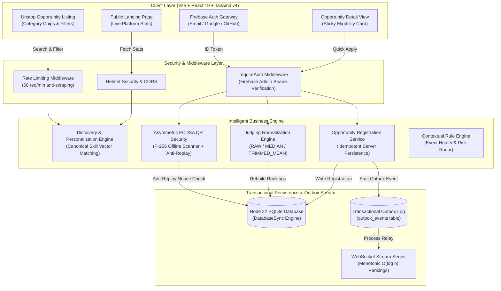

# EVENTOS v4 — Intelligent Talent Profile, Opportunity Discovery & Live Event Engine

[](https://nodejs.org/)
[](https://www.typescriptlang.org/)
[](https://react.dev/)
[](https://tailwindcss.com/)
[](https://vitejs.dev/)
[](https://firebase.google.com/)
[](file:///c:/Users/Ramakrishna/OneDrive/Pictures/java/Documents/Projects/EventOs/tests)

> **EVENTOS v4** is a context-aware talent profile, Unstop-style opportunity discovery platform, and real-time live event operations engine. Designed for hackathons, tech fests, developer competitions, and enterprise hiring ecosystems.

---

## 🎯 Executive Summary & Core Objective

### Problem Statement: Limitations of Traditional Platforms
Traditional developer event and hiring platforms suffer from critical structural flaws:
1. **Chatbot-Only AI (AI as UI)**: Contextless chatbots detached from real platform data.
2. **Opaque & Biased Evaluation**: Un-normalized judging scores leading to variance across judge panels.
3. **Insecure Attendance Verification**: Static QR credentials vulnerable to replay attacks and unauthorized sharing.
4. **Generic Opportunity Feeds**: Static listings with zero real-time eligibility checking or canonical skill vector matching.
5. **Hardcoded Identity Fallbacks**: Weak client-side role switchers compromising authorization boundaries.

### The EVENTOS v4 Solution
EVENTOS v4 solves these challenges by combining **deterministic decision engines**, **real-time outbox event streaming**, **server-authoritative Firebase ID token verification**, and **asymmetric ECDSA cryptography**:

```
Traditional Solutions (Flawed)             EVENTOS v4 Solution (Innovative)
┌──────────────────────────────┐          ┌─────────────────────────────────────────┐
│ Static QR Credentials        │   ➔      │ Asymmetric ECDSA QR + Anti-Replay Store │
│ Raw Average Score Judging    │   ➔      │ Trimmed Mean / Winsorized Normalization │
│ Generic Unfiltered Feeds     │   ➔      │ Canonical Skill Vector Matching Feed    │
│ Client-Supplied Role Headers │   ➔      │ Firebase Admin SDK Bearer Token Verification│
└──────────────────────────────┘          └─────────────────────────────────────────┘
```

---

## 🏗️ System Architecture

The following Mermaid diagram illustrates the end-to-end dataflow across the Client Layer, API Gateway, Security Policy Boundary, Decision Engine, and Transactional Persistence Layer:



---

## 🛠️ Technology Stack Matrix

| Layer | Technologies & Frameworks | Key Purpose & Capabilities |
| :--- | :--- | :--- |
| **Frontend Framework** | `React 19`, `Vite 8.2` | Ultra-fast client SPA rendering, hot module replacement, client hash routing |
| **Styling & Design** | `Tailwind CSS v4`, `@tailwindcss/postcss`, `PostCSS 8` | Modern Tailwind v4 engine, glassmorphism utilities, CSS custom design tokens |
| **Identity & Auth** | `Firebase JS SDK v10`, `Firebase Admin SDK` | Email/Password, Google OAuth, GitHub OAuth, server-side JWT ID token verification |
| **Database Engine** | Node 22 `node:sqlite` (`DatabaseSync`) | High-performance zero-compilation local SQLite database with relational constraints |
| **Security & Crypto** | `Node.js Crypto`, `ECDSA P-256`, `Helmet`, `express-rate-limit` | Asymmetric QR credential signing, anti-replay store, strict API security boundaries |
| **Realtime Stream** | `ws` (WebSocket), Transactional Outbox | Real-time leaderboard updates with sequence numbers and monotonic state projection |
| **Test Automation** | Node Native Test Runner (`node:test`), `tsx` | 31 automated unit, integration, security, and e2e role tests |

---

## 🌟 Key Product Features & Technical Innovations

### 1. Unstop-Style Opportunity Discovery & Registration
- **Dynamic Live Heading**: Displays real-time matching count e.g., `"12 Internships for Students"`.
- **Category Icon Strip**: Quick filtering for **Internships**, **Jobs**, **Competitions**, **Mock Tests**, **Mock Interviews**, **Hackathons**, and **Mentorships**.
- **Filter Bar**: Granular control over **Work Mode** (Remote, Hybrid, On-Site, Online), **Location**, and **Sort Order** (Relevance Score, Deadline).
- **Sticky Eligibility Card**: Displays the authenticated user's real avatar, display name, and email from session.
- **Server-Side Registration**: `POST /api/opportunities/:id/register` creates idempotent rows in `opportunity_registrations` and logs an audit event in the outbox stream.

### 2. Embedded Contextual Decision Engine
- **Policy-First Boundary**: RBAC policy check executes *before* context retrieval or LLM execution, preventing privilege escalation.
- **Personalization Signals**: Matches user canonical skill tags (`react`, `typescript`, `ai_ml`) and career goals against opportunity requirements to rank recommendations.

### 3. Judging Normalization Engine
- Supports 4 configurable score normalization strategies to eliminate judge variance:
  - **RAW**: Weighted arithmetic mean.
  - **MEDIAN**: Middle score selection.
  - **TRIMMED_MEAN**: Excludes minimum and maximum extreme scores before averaging.
  - **WINSORIZED**: Replaces extreme outlier values with nearest inner values.

### 4. Asymmetric ECDSA QR Security & Anti-Replay
- Generates P-256 ECDSA digitally signed credentials with short TTLs (20-30s).
- Offline scanners verify integrity using the server's public key PEM (`GET /api/qr/public-key`).
- Server anti-replay store rejects duplicate check-in scans using `credential_id` nonces.

---

## 🗺️ Route Architecture & Sitemap

```
PUBLIC MARKETING & DISCOVERY
├── #/                                (Landing Page: Live Stats + Unstop Icon Strip + Featured Carousel)
├── #/discover                        (Opportunity Listing Feed with Filter Bar & Horizontal Cards)
├── #/opportunities/:id               (Opportunity Detail Page with Sticky Eligibility & Quick Apply)
├── #/events/:slug/leaderboard        (Public Live Rankings with WebSocket Stream)
├── #/organizations                   (Verified Organization Directory)
└── #/people                          (Developer Community Directory)

AUTHENTICATION & ONBOARDING
├── #/login                           (Email/Password, Google OAuth & GitHub OAuth Sign-In)
├── #/register                        (New Account Sign-Up + Auto-Trigger Personalization Overlay)
└── #/onboarding                      (5-Step Progressive Profile Wizard)

PARTICIPANT WORKSPACE (#/dashboard)
├── #/dashboard/my-events             (My Registered Events & Application Statuses)
├── #/dashboard/teams                 (Skill-Vector Team Matchmaker)
└── #/dashboard/submissions           (Project Submission Portal with Checklist Validation)

JUDGE DESK (#/judge)
├── #/judge/queue                     (Priority Evaluation Queue)
├── #/judge/evaluate/:submissionId    (Split-Screen Scoring Environment with Rubric Sliders)
└── #/judge/conflicts                 (Conflict of Interest Tracking)

ORGANIZER COMMAND CENTER (#/organizer)
├── #/organizer/overview              (Event Pulse & Predictive Health Score)
├── #/organizer/risks                 (Operational Anomaly Radar)
├── #/organizer/venues                (Live Venue Digital Twin & Congestion Metrics)
├── #/organizer/actions               (Human-in-the-Loop Action Approval Queue)
└── #/organizer/audit                 (Immutable Audit Event Log)
```

---

## 🚀 Getting Started & Execution

### 1. Installation
Clone the repository and install dependencies:
```bash
git clone https://github.com/ramakrishnanyadav/EventOS.git
cd EventOS
npm install
```

### 2. Run Production Build
Compile the client SPA bundle via Vite and Tailwind v4:
```bash
npm run build
```

### 3. Launch Development Server
Start the Express API server and WebSocket engine:
```bash
npm start
```
Open [http://localhost:3000](http://localhost:3000) in your browser.

### 4. Execute Automated Test Suite
Run all 31 unit, integration, and security tests:
```bash
npm test
```

---

## 📄 Security & Environment Policies
- **Client API Key**: Firebase Client API Key is public by design and safe for frontend client bundles.
- **Admin Service Account**: Server authentication uses `FIREBASE_SERVICE_ACCOUNT` or `GOOGLE_APPLICATION_CREDENTIALS`. See [`SECURITY.md`](SECURITY.md) for full compliance guidelines.

---

## 📜 License
Licensed under the [MIT License](LICENSE). Built for the global developer ecosystem by the EVENTOS Core Engineering Team.
